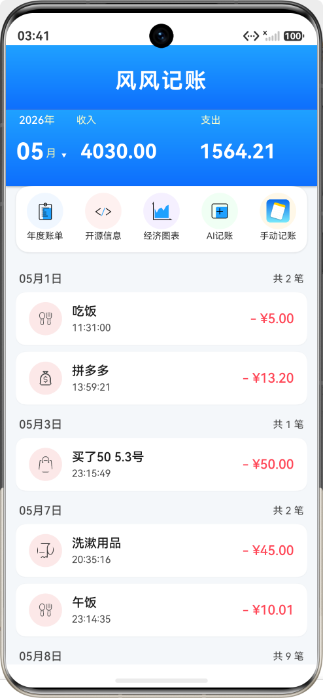
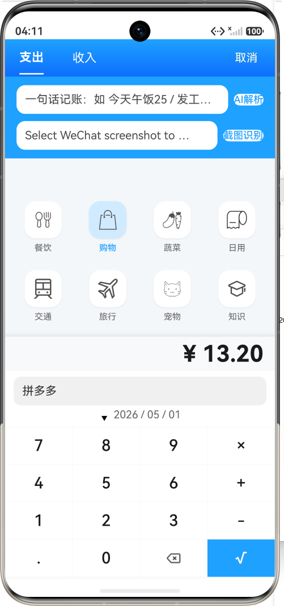
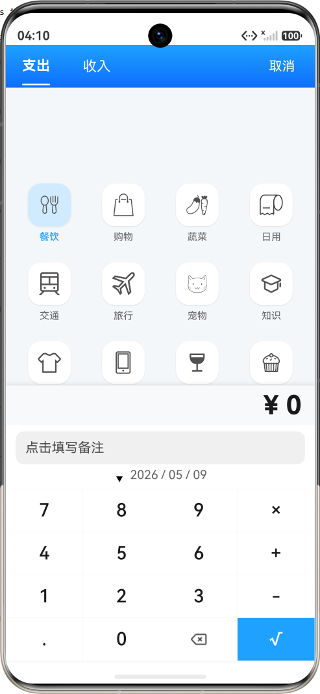
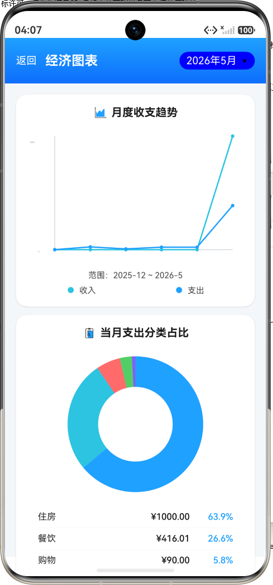
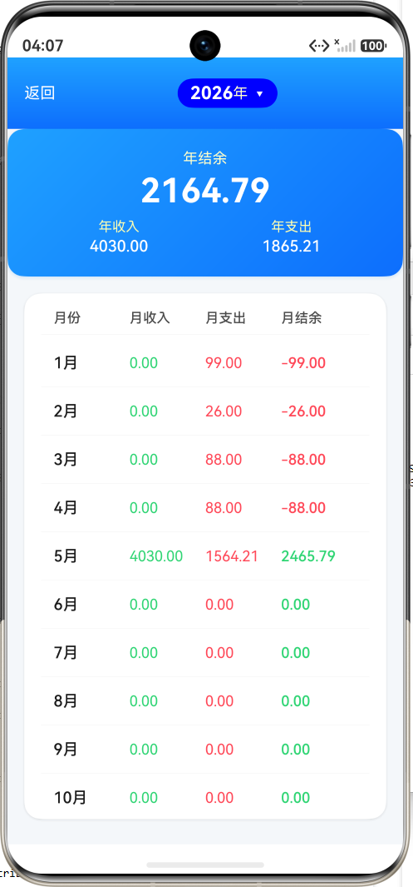
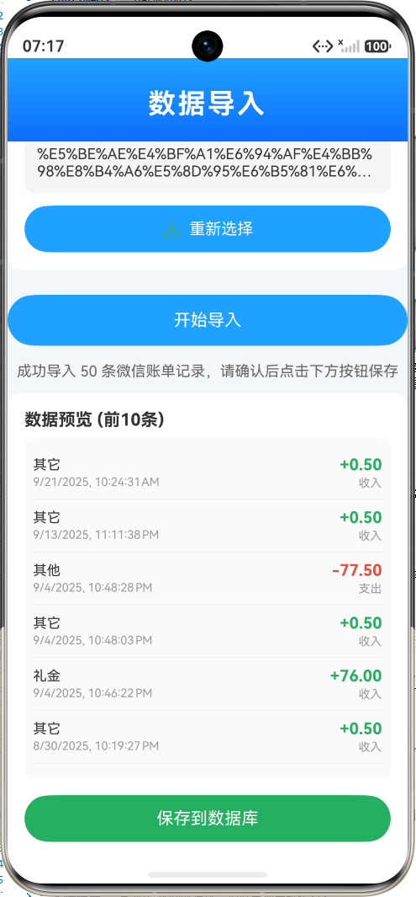
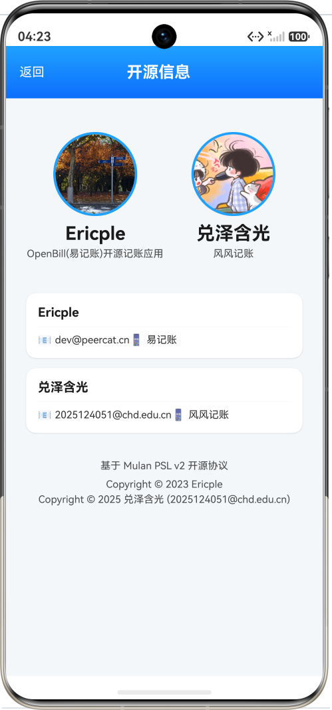

<div align="center">
<h1>风风记账</h1>

</div>

## 项目介绍

风风记账 是一个运行于 Harmony OS 3.1+ 操作系统上，使用 ArkUI 框架开发的一款开源账单记录软件。
采用木兰许可证签署许可。

部分图标来源： [iconFont](https://www.iconfont.cn/)

## 更新日志

### v1.1.0 — UI 全面重构 (2026-06-14)

- **设计系统统一**：建立完整的 Design System，统一颜色（主蓝 `#3B82F6`、语义红绿）、排版、间距、圆角、阴影规范
- **渐变统一**：所有页面 Header 渐变统一为蓝蓝渐变，移除不一致的青绿色
- **颜色规范化**：全应用 500+ 处硬编码十六进制颜色值替换为语义化设计令牌
- **图表增强**：折线图添加贝塞尔曲线平滑和网格线，饼图优化配色和视觉效果

## 开发环境

- Windows 11 2H2 Build.22621.2134
- DevEco Studio 6.1.1.268


## 测试环境

- DevEco Studio 6.1.1.268
- Pura 90 - OpenHarmony

## 安装说明

请复制/entry/src/main/ets/ai/AiBillingConfig.template.ets文件为 AiBillingConfig.ets 并填入你的真实 API Key
使用 DevEco Studio 6.1.1.268编译运行
## 已实现功能

- **记账**：支持支出/收入分类选择、自定义备注、日期选择
- **AI 记账**：在新增账单页输入一句话，自动识别金额/收支/分类/日期并回填（支持本地规则解析 + LLM 增强）
- **AI 图片识别**：从图库选择账单截图，AI 自动识别金额/收支/分类/日期/商户名称并回填
- **年度账单汇总**：查看年度收入、支出、结余概览，按月明细统计
- **经济图表**：月度收支趋势折线图、支出/收入分类占比饼图（切片上显示百分比标签）、经济分析、空状态提示
- **编辑账单**：长按账单列表项进入编辑，修改金额/分类/备注/日期
- **删除账单**：长按账单列表项弹出确认删除对话框
- **数字键盘计算器**：记账时支持加、减、乘计算后填入金额
- **搜索筛选**：首页支持关键词搜索备注/分类，按收支方向（收入/支出/全部）筛选，按分类标签筛选
- **首页消费简报**：首页展示今日收入/支出/笔数、较昨日和较本月日均支出的变化，并联动预算进度
- **预算管理**：支持设置月度总预算和分类预算，首页/预算页展示预算进度、剩余金额和超支提示
- **隐私锁**：支持设置 PIN 码保护账单数据，进入应用或从后台回到前台时要求解锁
- **数据导入**：支持导入标准 CSV 格式账单、微信官方导出的 CSV/XLSX 账单，自动识别文件格式并智能分类
- **数据导出**：将账单数据导出为标准 CSV 文件，便于备份与迁移
- **设置页面**：全局设置页，包含通用设置（货币单位选择 ¥$€£）、预算管理、隐私锁、AI 配置入口、数据管理（清除数据）、关于信息
- **AI 配置页面**：在应用内直接编辑文字识别和图片识别的 API Base URL / Key，无需修改配置文件
- **开源信息页面**：展示项目开源许可信息
- **货币单位全局切换**：支持 ¥ / $ / € / £ 四种货币，切换后首页、图表、记账页金额自动按汇率换算
- **快捷记账悬浮按钮**：首页底部悬浮快捷入口，支持选择收支方向、输入金额、图标分类网格，一键保存
- **新手引导**：首次使用应用时展示功能引导页，支持分页滑动和跳过

## AI 记账配置（可选）

AI 解析支持"本地规则解析 + 可选 LLM 增强"。你可以在设置页 → AI 配置中直接编辑，或在以下文件中本地配置：

- `entry/src/main/ets/ai/AiBillingConfig.ets`（不要提交真实密钥）

默认值：
- `baseUrl`: OpenAI 兼容的 `chat/completions` 接口地址
- `apiKey`: 你的 API 密钥
- `model`: 模型名

> 💡 在应用内通过 **设置 → AI 配置** 页面编辑的配置会保存到 Preferences，运行时优先读取。

不用配置也能使用基础规则解析（中英文口语、简单日期/金额/收支）。

## 待优化功能

- 记账
    - 新增拍照选项（直接拍照，从图库选择已支持）
- 桌面服务卡片
    - 当前 DevEco/HarmonyOS SDK 环境暂不支持本项目目标版本的 FormExtensionAbility，后续升级 SDK 后再启用桌面卡片
- 数据安全
    - 后续可考虑将 AI API Key 迁移到更安全的存储方案或服务端代理

## 性能优化

### 启动与数据加载
- **数据库懒加载**：DBManager 采用单例模式，数据库连接在首次调用时初始化，不阻塞应用启动
- **异步数据加载**：所有数据库查询均返回 Promise，首页账单数据在 onPageShow() 中异步加载，UI 优先渲染
- **按月过滤计算**：首页只计算选中月份的收支统计，避免全量数据遍历

### 列表渲染优化
- **虚拟列表**：使用 List + ForEach 组件实现账单列表，利用 List 虚拟化能力仅渲染可见项
- **按天分组**：账单通过 explodeMonthlyArray 按天分组展示，避免一次性渲染全部条目
- **文本截断**：长文本使用 maxLines + textOverflow: Ellipsis 控制显示行数，防止过度渲染

### 图表渲染优化
- **Canvas 自绘**：饼图使用 Canvas 2D API 绘制而非复杂 UI 组件，大幅减少节点数
- **切片数量控制**：饼图切片上限为 6 项，超出部分合并为"其他"，避免过多切片导致渲染性能下降
- **响应式重绘**：图表组件监听 onAreaChange 自适应尺寸变化，仅在需要时重绘

### 数据查询优化
- **SQL 级别过滤**：按日期范围查询使用 SQL WHERE 条件过滤而非应用层遍历
- **Map 预聚合**：月度趋势统计使用 Map 按年月预聚合数据，避免逐月遍历全量账单
- **查询结果限制**：调试日志查询使用 LIMIT 子句限制返回行数

### 数据库操作优化
- **单例连接池**：全局唯一 DBManager 实例，避免重复创建数据库连接
- **异步非阻塞**：所有 CRUD 操作通过 Promise 异步执行，不阻塞 UI 主线程
- **SQL 逐条执行**：建表语句按分号拆分后逐条执行，兼容不同 RDB 实现

### 内存与资源管理
- **文件句柄及时释放**：文件读写操作严格遵循 openSync/closeSync 配对，防止句柄泄漏
- **HTTP 连接释放**：AI API 请求完成后调用 request.destroy() 释放网络资源
- **临时文件清理**：XLSX 导入完成后立即删除解压的临时文件和复制文件
- **资源引用优化**：使用 $r() 引用系统资源而非硬编码字符串，减少内存占用

### AI 解析性能
- **规则引擎优先**：AI 解析先通过本地规则引擎快速匹配，置信度足够时不再调用 LLM
- **LLM 降级调用**：仅在规则解析置信度不足时调用远程 AI 接口，减少网络请求
- **超时保护**：AI 接口设置 120 秒超时，防止长时间阻塞

### 导入导出优化
- **CSV 编码优化**：导出文件带 UTF-8 BOM 头，确保 Excel 直接正确识别中文
- **大文件流式读取**：CSV/XLSX 文件使用二进制读取后解析，避免内存溢出
- **数据预览**：导入时仅预览前 10 条数据，避免大数据量时界面卡顿

## 项目界面预览

> ⚠️ 以下截图为 v1.0.0 版本界面，v1.1.0 UI 重构后视觉已全面更新（配色统一、图表增强）。截图正在更新中。

<div style="display: flex; gap: 8px; flex-wrap: nowrap; overflow-x: auto;">
  
  
  
  
  
  
  
  

</div>


## 项目来源
https://gitee.com/ericple/oh-bill

## 版权声明

- Copyright © 2023 Ericple
- Copyright © 2025 兑泽含光 (2025124051@chd.edu.cn)

本项目基于 **木兰宽松许可证 (Mulan PSL v2)** 签署许可。

## 捐助

风风记账 是一个免费开源的项目，它将会有一些功能依赖于网络。它的开发和维护也需要投入大量精力，
如果您愿意赞助该项目或为我买一杯咖啡，那将会是对本项目最好的支持！

<div style="display: flex; gap: 8px; flex-wrap: nowrap; overflow-x: auto;">


</div>


# 风风记账（智能账单管理）项目技术说明文档

> **文档版本**：v1.0  
> **最后更新**：2026-05-09  
> **文档状态**：初稿 / 内部评审  
> **适用读者**：项目组成员、评审人员、后期维护人员

---

## 一、项目概述

### 1.1 项目背景与目标

风风记账是一款基于鸿蒙（HarmonyOS）Stage 模型开发的个人智能账单管理应用，旨在为用户提供**高效、智能、直观**的记账体验。传统记账应用通常需要用户手动逐笔输入，操作繁琐且容易遗漏。风风记账通过引入 AI 能力（自然语言解析与图像识别），让用户只需输入一句话或拍摄一张账单截图即可完成记账，大幅降低记账门槛。

**核心目标**：
- 提供**AI 智能记账**能力，支持一句话文字记账和微信/支付宝账单截图识别
- 实现**月度/年度财务统计**，以图表形式直观展示收支趋势与分类占比
- 支持**手动记账**与**计算器辅助输入**，覆盖多种记账场景
- 提供**数据持久化**能力，确保账单数据安全可靠存储

### 1.2 解决的问题与核心价值

| 问题 | 解决方案 | 核心价值 |
|------|----------|----------|
| 记账操作繁琐 | AI 一句话记账 + 图片识别 | 3 秒完成一笔记账 |
| 财务数据难以直观理解 | 折线图 + 饼图 + 统计分析 | 一目了然掌握财务状况 |
| 收支分类管理混乱 | 预设分类 + AI 自动归类 | 规范化记账分类 |
| 账单信息零散 | 按日/月/年维度聚合展示 | 时间维度的完整追溯 |

### 1.3 适用场景与典型用户

- **适用场景**：个人日常消费记账、家庭月度收支管理、年度财务回顾
- **典型用户**：希望养成记账习惯的年轻人、需要追踪支出的上班族、希望了解财务健康状况的个人用户

---

## 二、系统架构设计

### 2.1 整体架构（文字描述）

风风记账采用鸿蒙 Stage 模型下的**单 Ability 多 Page** 架构，整体分为四层：

```
┌─────────────────────────────────────────────┐
│              UI 展示层（ArkUI）                │
│  Index  |  AddBalance  |  EconomicCharts     │
│  BillInfoPage  |  Copyright  |  Charts       │
│  DataImport  |  DataExport                   │
├─────────────────────────────────────────────┤
│              业务逻辑层                        │
│  AiBillingParser  |  ImageProcessor          │
│  BalanceViewer  |  BalanceList  |  PageEntries│
│  CSVUtils                                    │
├─────────────────────────────────────────────┤
│              数据管理层                        │
│  DBManager  |  BillingInfoUtils             │
│  EconomicStatsUtils  |  SettingManager       │
├─────────────────────────────────────────────┤
│           鸿蒙系统能力层                        │
│  RelationalStore  |  Router  |  HTTP         │
│  File I/O  |  PhotoAccessHelper              │
│  FilePicker  |  XLSX (SheetJS)               │
└─────────────────────────────────────────────┘
```

### 2.2 分层结构说明

#### UI 层（展示层）
- 基于 **ArkUI 声明式框架**构建，所有页面均采用 `@Entry` + `@Component` 结构
- 使用 **ArkTS 语言**开发，类型安全且与 ArkUI 深度集成
- 页面间通过 `@ohos.router` 进行路由跳转与参数传递

#### 业务逻辑层
- **AI 记账引擎**：包含 `AiBillingParser`（文字解析）和 `ImageProcessor`（图像识别），调用 OpenAI 兼容接口实现智能解析
- **账单展示组件**：`BalanceViewer`（月度概览）、`BalanceList`（按日分组列表）、`PageEntries`（功能入口）
- **统计分析**：`EconomicStatsUtils` 负责月度/年度收支统计、环比分析、异常检测

#### 数据管理层
- **DBManager**：基于 `@ohos.data.relationalStore`（RDB）的单例数据库管理器，封装所有 CRUD 操作
- **数据工具类**：`BillingInfoUtils` 提供结果集解析、按日期/类型过滤、月度/年度分组等工具方法
- **配置管理**：`SettingManager` 与 `CommonConfiguration` 管理应用偏好设置

#### 系统能力层
- 数据持久化：`relationalStore`（关系型数据库）
- 页面路由：`@ohos.router`
- 网络通信：`@ohos.net.http`
- 文件操作：`@ohos.file.fs`、`@ohos.file.picker`、`@ohos.file.photoAccessHelper`

### 2.3 模型选择及原因

本项目选择 **Stage 模型**，原因如下：

1. **组件化设计**：Stage 模型天然支持多 HAP（Harmony Ability Package）架构，便于将 common 模块抽取为共享 HAR 包
2. **生命周期管理**：Stage 模型的 Ability 生命周期（`onCreate`、`onForeground`、`onBackground`、`onDestroy`）更加清晰，适合管理数据库连接等全局资源
3. **上下文独立**：每个 Ability 拥有独立的 `Context`，便于资源管理与权限控制
4. **后台任务能力**：Stage 模型对 Service Ability 和后台任务的支持更完善，便于后续扩展

---

## 三、核心功能模块说明

### 3.1 Ability / Page 职责

#### Entry Ability（主入口）
- 应用启动入口，加载首页 `Index.ets`
- 负责数据库初始化和全局上下文管理
- 管理应用的完整生命周期

#### Index.ets（首页）
- **核心职责**：作为应用主界面，整合月度账单概览与账单列表
- 包含三个子组件：`BalanceViewer`（顶部概览栏）、`BalanceList`（账单列表）、`PageEntries`（底部功能入口）
- 通过 `@State` 管理 `selectedDate`、`currentBillingInfo`、`totalBalance`、`totalIncome` 等核心状态
- 在 `onPageShow` 生命周期中自动从数据库加载当月账单数据

#### AddBalance.ets（记账页）
- **核心职责**：提供 AI 智能记账和手动记账两种录入模式
- AI 模式：包含一句话文字输入框 + 图片识别按钮
- 手动模式：包含分类选择网格 + 金额数字键盘 + 备注输入 + 日期选择
- 支持编辑已有账单（通过 `editId` 参数回填数据）
- 内置计算器功能（加、减、乘）

#### EconomicCharts.ets（经济图表页）
- **核心职责**：以可视化图表展示财务数据
- 包含三大图表模块：月度收支趋势折线图、支出分类占比饼图、收入分类占比饼图
- 底部展示经济分析文案（环比变化、异常消费检测）
- 支持月份选择切换

#### BillInfoPage.ets（年度账单页）
- **核心职责**：展示年度账单汇总，按月度展示收入、支出、结余
- 顶部展示年结余、年收入、年支出概览
- 主区域展示 1-12 月的月度明细列表
- 支持年份选择切换

#### DataImport.ets（数据导入页）
- **核心职责**：提供文件选择与导入功能，支持标准 CSV 格式和微信官方导出的 CSV/XLSX 格式
- 通过 `FilePicker` 选择文件，使用 `CSVUtils` 解析文件内容
- 自动识别文件格式（标准 CSV / 微信 CSV / 微信 XLSX），智能匹配字段并分类
- 导入前展示预览列表，支持用户确认后批量写入数据库

#### DataExport.ets（数据导出页）
- **核心职责**：将本地账单数据导出为标准 CSV 文件
- 支持选择导出时间范围（全部/指定月份）
- 通过 `FilePicker` 选择保存路径，使用 `CSVUtils` 生成 CSV 文件
- 导出完成后提示用户导出结果

#### Copyright.ets（开源信息页）
- 展示项目开源许可证信息（Mulan PSL v2）

### 3.2 模块间调用关系

```
┌──────────────────────────────────────────────────┐
│                    Index.ets                       │
│  ┌──────────┐  ┌───────────┐  ┌──────────────┐   │
│  │BalanceView│  │BalanceList│  │ PageEntries   │   │
│  │   er      │  │           │  │               │   │
│  └──────────┘  └───────────┘  └──────┬───────┘   │
│                                      │            │
└──────────────────────────────────────┼────────────┘
                                       │ router.pushUrl
          ┌────────────────────────────┼────────────────┐
          │                            │                 │
          ▼                            ▼                 ▼
  ┌───────────────┐          ┌──────────────┐   ┌──────────────┐
  │  AddBalance   │          │EconomicCharts│   │ BillInfoPage │
  │  (AI/Manual)  │          │              │   │              │
  └───────┬───────┘          └──────────────┘   └──────────────┘
          │
    ┌─────┴─────┐
    │           │
    ▼           ▼
AiBillingParser  ImageProcessor
    │           │
    └─────┬─────┘
          │
          ▼
      AiHttpClient  ───→ 外部 AI API
```

### 3.3 关键业务流程简述

**AI 一句话记账流程**：
1. 用户在 `AddBalance` 页面的输入框中输入自然语言描述（如"今天午饭25"）
2. 点击解析按钮后调用 `AiBillingParser.parseToBill()`
3. 解析器先通过**规则引擎**进行本地解析（关键词匹配提取金额、方向、分类）
4. 若规则解析置信度不足（< 0.8），则调用**LLM 接口**进行 AI 辅助解析
5. 将规则解析结果与 LLM 解析结果进行**融合**，取置信度更高的值
6. 若信息完整（金额、方向、分类均解析成功），自动回填到记账表单
7. 若信息缺失，向用户提示需补充的字段

**图像识别记账流程**：
1. 用户点击图片识别按钮，通过 `PhotoViewPicker` 选择相册中的账单截图
2. `ImageProcessor.recognizeImageText()` 将图片读取为 base64 编码
3. 调用支持视觉识别的 AI 模型（如 GLM-4V-Flash）进行图像内容解析
4. 解析返回的 JSON 中包含金额、方向、分类、日期、备注等信息
5. 经过合理性校验后回填到记账表单

**月度账单加载流程**：
1. 首页 `onPageShow()` 时调用 `DBManager.getAllBillingInfo()` 获取全量数据
2. 使用 `BillingInfoUtils.filterByDate()` 按当前选中月份过滤
3. 使用 `BillingInfoUtils.explodeMonthlyArray()` 按天分组
4. 分别计算当月总收入和总支出，传递给 `BalanceViewer` 和 `BalanceList` 展示

---

## 四、鸿蒙关键技术点

### 4.1 分布式能力

**说明**：当前版本 风风记账尚未启用分布式能力，但架构预留了扩展空间。`common` 模块中的 `DataTypes`（`BillingInfo`、`BillingType`）数据结构设计时已考虑序列化需求，后续可对接 **Distributed Data Object（DDO）** 或 **Distributed KV-Store** 实现跨设备数据同步。

> **示例**：通过 `@ohos.data.distributedKVStore` 实现手机与平板间的账单数据实时同步，或通过 `@ohos.distributedDeviceManager` 实现跨设备能力迁移。

### 4.2 ArkUI 声明式 UI 使用方式

本项目全面采用 **ArkUI 声明式 UI 框架**，以 `@Component` 装饰的结构体定义 UI 组件，在 `build()` 方法中以链式调用方式描述界面结构。

**典型模式**：
- **自定义组件**：将可复用的 UI 单元抽取为 `@Component`（如 `BalanceViewer`、`BalanceList`、`PieChart`）
- **条件渲染**：使用 `if/else` 控制 UI 分支（如 AI 模式与手动模式的切换）
- **循环渲染**：使用 `ForEach` 遍历列表数据（如账单列表、分类网格）
- **链式属性配置**：通过 `.width()`、`.height()`、`.backgroundColor()` 等方法链式设置组件属性
- **响应式布局**：使用 `Flex`、`GridRow`/`GridCol`、`Stack` 等布局容器实现自适应

### 4.3 状态管理（@State、@Link、@Prop 等）

项目使用 ArkUI 提供的装饰器实现组件间的状态同步：

| 装饰器 | 用途 | 示例场景 |
|--------|------|----------|
| **@State** | 组件内部可变状态 | `AddBalance` 中的 `aiInputText`、`balanceAmount`、`activeTab` |
| **@Link** | 父子组件间双向绑定 | `BalanceList` 中的 `currentBillingInfo`、`totalBalance` 与 `Index` 页双向同步 |
| **@Prop** | 父传子单向数据 | 图表组件接收数据配置（如 `PieChart` 接收 `slices`） |
| **@Watch** | 状态变化监听 | 用于响应数据变化触发 UI 更新 |

**状态管理原则**：
- 页面级状态集中在 `@Entry` 组件中管理
- 跨组件共享状态使用 `@Link` 双向绑定
- 避免深层嵌套的状态传递，优先在最近公共父组件管理状态

### 4.4 IPC / RPC 通信机制

**说明**：当前版本为单 Ability 应用，未涉及跨进程通信。项目中的网络通信通过 `@ohos.net.http` 实现 HTTP 请求，与外部 AI API 进行数据交互。

> **示例**：`AiHttpClient.postJson()` 封装了 HTTP POST 请求，设置 `Content-Type: application/json` 请求头和超时时间，返回 `HttpJsonResponse` 包含状态码和响应体。

### 4.5 权限管理与安全策略

当前版本涉及以下权限声明：

| 权限 | 用途 |
|------|------|
| `ohos.permission.READ_MEDIA` | 读取相册图片用于 AI 图像识别 |
| 网络访问权限 | 访问外部 AI API |

**安全实践**：
- AI API Key 硬编码在 `AiBillingConfig.ets` 中，**生产环境应迁移至安全存储**（如 `@ohos.security.huks` 或服务器端代理）
- 数据库安全级别设置为 `SecurityLevel.S1`（最低安全级别，适合个人消费数据）
- 数据库文件存储在应用私有目录，不对外暴露

### 4.6 后台任务、通知、数据持久化

**数据持久化**：
- 主要使用 **RelationalStore（RDB）** 存储账单数据，建表 SQL 在 `CommonConfiguration` 中定义
- 包含两张表：`BILLING`（账单主表）和 `BILLING_TYPE`（分类表）
- 应用偏好设置使用 **Preferences** 存储

**后台任务**：
> **示例**：后续可考虑添加定时记账提醒，使用 `@ohos.workScheduler` 实现后台定时任务。

**通知**：
> **示例**：后续可对接 `@ohos.notification` 实现每日消费简报推送。

---

## 五、数据设计与存储方案

### 5.1 数据库设计

#### BILLING（账单主表）

| 字段名 | 类型 | 说明 |
|--------|------|------|
| ID | INTEGER PRIMARY KEY AUTOINCREMENT | 主键，自增 |
| TYPE | TEXT NOT NULL | 账单分类（JSON 格式，包含 icon 和 name） |
| AMOUNT | REAL NOT NULL | 金额 |
| DIRECTION | INTEGER NOT NULL | 收支方向（0=收入 IN, 1=支出 OUT） |
| TIMESTAMP | UNSIGNED BIG INT | 交易时间戳（毫秒） |
| REMARK | TEXT | 备注文本 |
| IMAGE | TEXT | 关联图片路径 |

#### BILLING_TYPE（分类表）

| 字段名 | 类型 | 说明 |
|--------|------|------|
| ID | INTEGER PRIMARY KEY AUTOINCREMENT | 主键 |
| ICON | TEXT NOT NULL | 分类图标资源引用 |
| NAME | TEXT NOT NULL | 分类名称（如"餐饮"、"交通"、"工资"） |

### 5.2 本地数据库（RDB）

项目使用 **`@ohos.data.relationalStore`** 作为本地数据库引擎，核心设计如下：

- **单例模式**：`DBManager` 采用懒加载单例实现，确保全局只有一个数据库连接实例
- **异步 API**：所有 CRUD 操作均返回 `Promise`，避免阻塞 UI 线程
- **连接管理**：在首次调用时通过 `getRdbStore()` 获取存储实例，SQL 初始化在配置中集中管理
- **数据模型**：`BillingInfo` 接口定义完整的数据结构，`BillingInfoUtils` 提供 ResultSet 与对象间的转换

**数据库操作接口**（由 DBManager 提供）：
- `getAllBillingInfo()` — 获取全部账单数据
- `addBillingInfo(info)` — 新增一条账单
- `updateBillingInfo(info)` — 更新账单信息
- `deleteBillingInfo(id)` — 删除指定账单
- `getBillingInfoById(id)` — 按 ID 查询单条账单
- `queryByDateRange(start, end)` — 按日期范围查询

### 5.3 Preferences / KV-Store

**说明**：应用偏好设置（如用户自定义配置）使用 Preferences 存储。`SettingManager` 封装了偏好读写接口，`CommonConfiguration` 中定义了 `SETTING_PREFERENCE_STORE_KEY` 作为存储标识。

> **示例**：可存储用户选中的默认记账分类、AI 服务配置偏好等。

### 5.4 网络数据交互方案

**AI API 调用流程**：
1. 构建符合 OpenAI Chat Completions 格式的请求体
2. 通过 `@ohos.net.http` 发送 POST 请求到配置的 API 端点
3. 解析返回的 JSON 响应，提取 `choices[0].message.content`
4. 从 AI 返回内容中提取 JSON 对象，映射为结构化账单数据

**超时策略**：默认超时时间为 120 秒（`timeoutMs: 120_000`），应对大模型推理延迟。

---

## 六、性能与稳定性设计

### 6.1 启动优化

- **懒加载数据库**：数据库连接在首次调用时初始化，不阻塞应用启动
- **异步数据加载**：首页账单数据在 `onPageShow()` 中异步加载，UI 优先渲染
- **状态保持**：`@State` 装饰的变量在页面切换时保持状态，避免重复加载

### 6.2 内存管理

- **数据分页**：月度账单按天分组展示，避免一次性渲染大量列表项
- **资源释放**：HTTP 请求完成后调用 `request.destroy()` 释放网络连接资源
- **文件句柄管理**：图片读取操作使用 `fs.openSync()` / `fs.closeSync()` 配对，确保句柄及时释放
- **图表数据优化**：饼图切片数限制为前 6 项，超出部分合并为"其他"，避免过多切片导致性能下降

### 6.3 线程模型

- **主线程**：负责 UI 渲染和 ArkUI 状态更新
- **异步任务**：所有数据库操作和网络请求均使用 `Promise` 异步处理，不阻塞主线程
- **同步操作**：仅在必要时使用同步 API（如文件读取 `fs.readSync`），配合合理错误处理

### 6.4 异常处理与日志（HiLog）策略

项目自定义了 **`Logger`** 工具类，提供统一日志输出接口：

| 方法 | 级别 | 用途 |
|------|------|------|
| `Logger.info()` | Info | 正常业务流程跟踪（如数据库查询结果、AI 响应内容） |
| `Logger.warn()` | Warn | 非预期但可恢复的情况（如 AI 返回不合理金额） |
| `Logger.err()` | Error | 异常错误（如数据库操作失败、AI 接口异常） |
| `Logger.log()` | Debug | 调试信息 |

**日志标识**：统一使用 `"BILL_LOGGER"` 作为日志标签前缀，便于在 DevEco Studio 的 HiLog 面板中过滤。

**异常处理原则**：
- 数据库操作异常通过 `.catch()` 捕获，向用户提示友好错误信息
- AI 接口异常不会导致应用崩溃，返回 `undefined` 并提示用户重试
- 图片识别失败有独立的降级提示，不影响其他功能使用

---

## 七、项目目录结构与代码规范

### 7.1 关键目录说明

```
oh-bill/
├── AppScope/                          # 应用全局配置
│   ├── app.json5                      # 应用元信息（名称、图标、版本等）
│   └── resources/                     # 全局资源文件
│
├── common/                            # 公共 HAR 模块（共享组件库）
│   ├── src/main/ets/
│   │   ├── DataTypes/                 # 数据类型定义
│   │   │   ├── BillingInfo.ets        # 账单数据接口 + 收支枚举
│   │   │   └── BillingType.ets        # 账单分类接口
│   │   ├── Manager/                   # 管理器
│   │   │   ├── DBManager.ets          # 数据库管理器（单例）
│   │   │   ├── SettingManager.ets     # 偏好设置管理器
│   │   │   └── CommonConfiguration.ts # 全局配置常量
│   │   └── Utils/                     # 工具类
│   │       ├── BillingInfoUtils.ets   # 账单数据处理工具
│   │       ├── DateUtils.ets          # 日期处理工具
│   │       ├── EconomicStatsUtils.ets # 经济统计工具
│   │       ├── Logger.ets            # 日志工具
│   │       └── StringUtils.ts        # 字符串处理工具
│   ├── index.ets                      # 模块导出入口
│   └── oh-package.json5               # HAR 包配置
│
├── entry/                             # 主 Entry HAP 模块
│   ├── src/main/
│   │   ├── ets/
│   │   │   ├── ai/                    # AI 智能记账模块
│   │   │   │   ├── AiBillingParser.ets  # AI 文字解析器
│   │   │   │   ├── AiBillingConfig.ets  # AI 服务配置
│   │   │   │   ├── AiBillingSettings.ets# AI 设置页面
│   │   │   │   ├── AiHttpClient.ets     # HTTP 客户端封装
│   │   │   │   └── ImageProcessor.ets   # 图像识别处理器
│   │   │   ├── data/                    # 数据类型与配置
│   │   │   │   └── balanceTypes.ets    # 收支分类列表（图标+名称）
│   │   │   ├── components/             # 可复用组件
│   │   │   │   ├── BalanceList.ets     # 账单列表组件
│   │   │   │   ├── BalanceViewer.ets   # 月度概览组件
│   │   │   │   ├── LockScreen.ets      # PIN 解锁界面
│   │   │   │   ├── OnboardingGuide.ets # 新手引导页
│   │   │   │   ├── QuickAddFab.ets     # 快捷记账悬浮按钮
│   │   │   │   ├── pageEntries.ets     # 功能入口组件
│   │   │   │   └── charts/            # 图表组件
│   │   │   │       ├── PieChart.ets    # 饼图组件（带百分比标签）
│   │   │   │       └── LineChart.ets   # 折线图组件
│   │   │   ├── utils/                  # 工具类
│   │   │   │   └── CSVUtils.ets        # CSV/XLSX 导入导出工具
│   │   │   └── pages/                  # 页面
│   │   │       ├── Index.ets           # 首页（概览+列表+快捷记账）
│   │   │       ├── addBalance.ets      # 记账页（AI+手动）
│   │   │       ├── BillInfoPage.ets    # 年度账单页
│   │   │       ├── BudgetPage.ets      # 预算管理页
│   │   │       ├── EconomicCharts.ets  # 经济图表页
│   │   │       ├── DataImport.ets      # 数据导入页
│   │   │       ├── DataExport.ets      # 数据导出页
│   │   │       ├── SettingsPage.ets    # 全局设置页
│   │   │       └── Copyright.ets       # 开源信息页
│   │   ├── module.json5                # HAP 模块配置
│   │   └── resources/                  # 页面资源文件
│   ├── build-profile.json5             # 构建配置
│   └── oh-package.json5                # 模块依赖配置
│
├── hvigor/                             # 构建工具配置
├── screenshots/                        # 应用截图
├── build-profile.json5                 # 工程级构建配置
└── hvigorfile.ts                       # 构建入口
```

### 7.2 命名规范

| 类别 | 规范 | 示例 |
|------|------|------|
| **文件命名** | PascalCase，后缀 .ets | `BalanceList.ets`、`AiBillingParser.ets` |
| **接口/类型** | PascalCase | `BillingInfo`、`MonthlyEconomyReport` |
| **枚举** | PascalCase，值 UPPER_CASE | `BillingDirection.IN`、`BillingDirection.OUT` |
| **类名** | PascalCase | `DBManager`、`EconomicStatsUtils` |
| **函数/方法** | camelCase | `getAllBillingInfo()`、`parseToBill()` |
| **变量/属性** | camelCase | `activeTab`、`balanceAmount`、`selectedTypeName` |
| **常量** | UPPER_SNAKE_CASE | `TEXT_AI_CONFIG`、`SETTING_PREFERENCE_STORE_KEY` |
| **资源引用** | `$r("app.xxx.xxx")` | `$r("app.string.balance")`、`$r("app.color.main_theme_blue")` |

### 7.3 模块化原则

1. **关注点分离**：`common` 模块承载跨 HAP 复用的数据类型、管理器和工具类；`entry` 模块承载页面和业务组件
2. **接口隔离**：`common/index.ets` 作为明确的模块导出入口，只暴露外部需要的类型和方法
3. **单例模式**：全局资源（如数据库连接）通过单例管理，避免重复初始化
4. **数据与 UI 分离**：数据处理逻辑集中在工具类和 Manager 中，页面组件仅负责 UI 展示和交互

---

## 八、运行环境与依赖说明

### 8.1 HarmonyOS SDK 版本

- **API 版本**：API 9（Stage Mode），maybe？
- **runtimeOS**：HarmonyOS
- **构建工具**：Hvigor（HarmonyOS 构建系统）

### 8.2 编译环境

- **DevEco Studio**：建议使用最新稳定版本
- **Node.js**：Hvigor 依赖 Node.js 环境
- **构建配置**：`entry/build-profile.json5` 中指定 `"apiType": "stageMode"`

### 8.3 真机 / 模拟器支持情况

| 目标设备 | 支持状态 | 说明 |
|----------|----------|------|
| **手机** | ✅ 完全支持 | 主目标设备，所有功能已验证 |
| **平板** | ⚠️ 兼容运行 | UI 布局需适配大屏场景 |
| **手表** | ⚠️ 未测试 | 屏幕尺寸过小，不适合账单管理场景 |
| **智慧屏** | ⚠️ 未测试 | 交互模式不匹配 |
| **车机** | ⚠️ 未测试 | 非典型使用场景 |

### 8.4 外部依赖说明

| 依赖 | 用途 | 说明 |
|------|------|------|
| OpenAI 兼容 API | AI 文字解析 | 通过 HTTP 调用，支持任意兼容接口 |
| GLM-4V-Flash（智谱） | AI 图像识别 | 免费视觉模型，用于账单截图识别 |
| Mulan PSL v2 | 开源协议 | 项目采用木兰宽松许可证 v2 |

---

## 九、总结与展望

风风记账作为一款基于鸿蒙 Stage 模型构建的个人智能账单管理应用，充分发挥了 ArkUI 声明式框架的开发效率与 RelationalStore 的本地数据管理能力。通过引入 AI 智能解析能力，显著降低了用户记账的操作成本，实现了"一句话记账"和"拍照记账"的创新体验。

### 当前已完成的核心能力

- ✅ **AI 一句话记账**：支持规则引擎 + LLM 混合解析，自动提取金额、方向、分类
- ✅ **图像识别记账**：支持微信/支付宝账单截图识别
- ✅ **手动记账**：分类选择 + 金额键盘 + 计算器功能
- ✅ **月度/年度账单**：按日/月/年维度聚合展示
- ✅ **可视化图表**：折线趋势图 + 分类占比饼图
- ✅ **经济分析**：环比变化 + 异常消费检测
- ✅ **数据导入**：支持标准 CSV、微信 CSV/XLSX 格式导入，自动识别文件格式并智能分类
- ✅ **数据导出**：将账单数据导出为标准 CSV 文件，便于备份与迁移

### 后续可扩展方向

- **分布式数据同步**：对接 Distributed Data Object 或分布式 KV-Store，实现手机与平板间的数据实时同步
- **云备份与恢复**：通过云端存储实现账单数据的备份与跨设备恢复
- **智能预算管理**：基于历史消费数据，自动生成月度预算建议
- **多币种支持**：扩展金额字段支持外币记账与汇率转换
- **小组件（Widget）**：开发 ArkUI 服务卡片，在桌面快速查看今日收支
- **语音记账**：接入语音识别能力，支持语音输入记账

---

> **文档结束** — 如有疑问或建议，请联系项目维护者。
