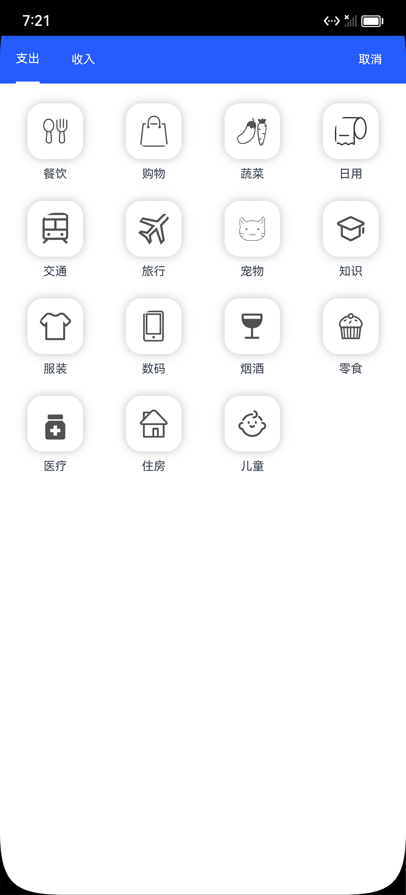
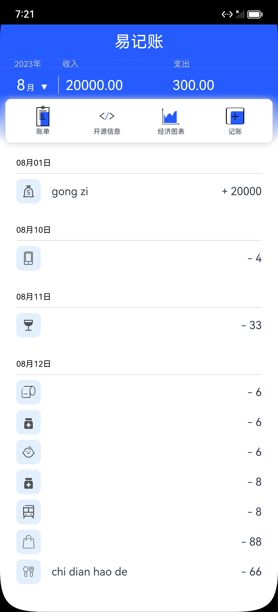
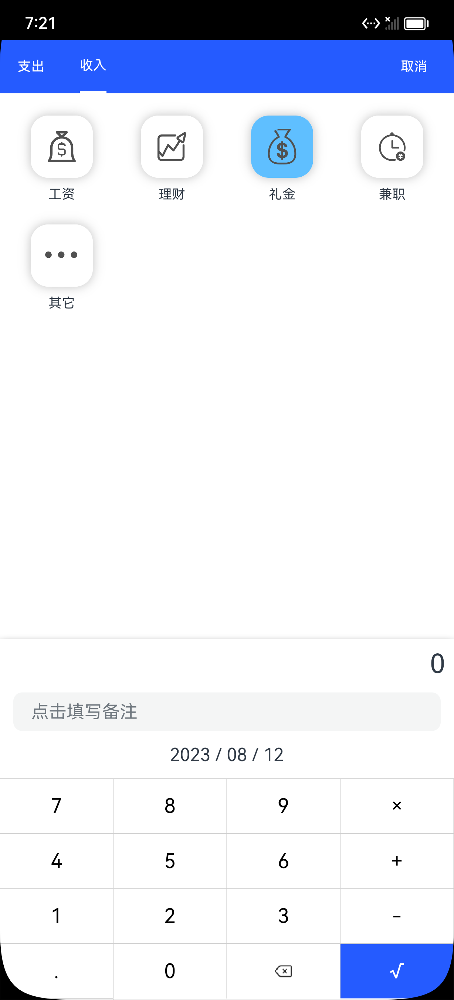
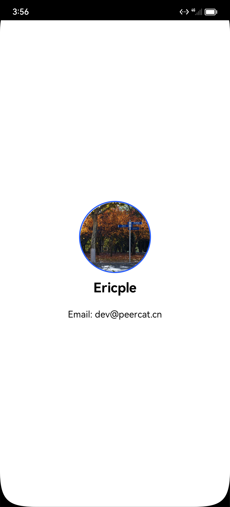

<h1>易记账</h1>

## 项目介绍

Open-Bill 是一个运行于Harmony OS 3.1+操作系统上，使用ArkUI框架开发的一款开源账单记录软件。
采用木兰许可证签署许可。

部分图标来源： [iconFont](https://www.iconfont.cn/)

## 开发环境

- Windows 11 2H2 Build.22621.2134
- DevEco Studio 3.1 Release
- SDK API9 3.2.12.5 Release

## 测试环境

- DevEco Virtual Device phone-x86-api9 3.1.0.306
- Oneplus 6T - fajita - OpenHarmony v3.2.14.6

## 已实现功能

- 记账
- 年度账单汇总

## 待开发功能

- 经济图表
- 账单详情

## 待优化功能

- 记账
    - 新增图片选项（拍照或从图库选择，随账单信息一同存入数据库）

## 软件截图

## 捐助

OpenBill是一个免费开源的项目，它将会有一些功能依赖于网络。它的开发和维护也需要投入大量精力，
如果您愿意赞助该项目或为我买一杯咖啡，那将会是对本项目最好的支持！

